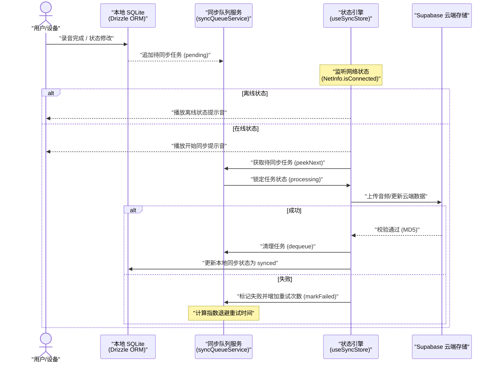
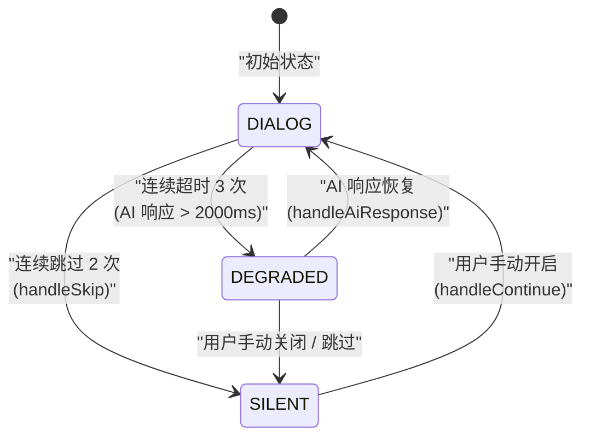
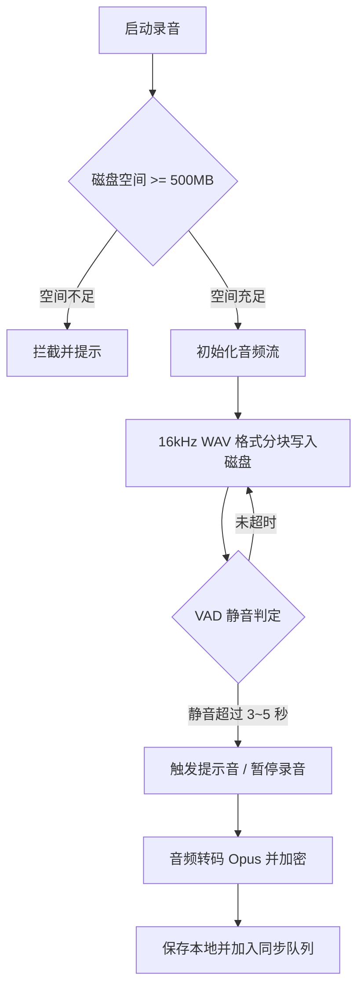

# TimeLog

[](LICENSE)
[](https://expo.dev/)
[](https://orm.drizzle.team/)

[🇨🇳 中文](README.md) | [🇺🇸 English](README_EN.md)

---

## 📑 目录

- [项目简介](#-项目简介)
- [核心架构与工程设计](#-核心架构与工程设计-architecture--design)
  - [1. 本地优先同步引擎与离线状态管理](#1-本地优先同步引擎与离线状态管理-local-first-sync-engine--network-as-state-)
  - [2. 语音对话代理与三模态协调引擎](#2-语音对话代理与三模态协调引擎-voice-agent--dialog-orchestrator-)
  - [3. 弱网主动探测服务](#3-弱网主动探测服务-network-quality-probing-)
  - [4. 原生音频录制与长者静音检测优化](#4-原生音频录制与长者静音检测优化-native-audio--vad-optimization-)
  - [5. 口述文本 AI 润色与 PDF 本地导出](#5-口述文本-ai-润色与-pdf-本地导出-ai-polished-text--pdf-export-)
  - [6. 基于 Proxy 的多语言数据代理](#6-基于-proxy-的多语言数据代理-proxy-based-localization-)
  - [7. 无障碍设计与多历法时间格式化](#7-无障碍设计与多历法时间格式化-accessibility--localized-calendars-)
  - [8. 基于活跃度检测的系统级定时提醒](#8-基于活跃度检测的系统级定时提醒-gentle-nudge--native-notifications-)
  - [9. 本地 SQLite 多账户数据物理隔离](#9-本地-sqlite-多账户数据物理隔离-multi-account-local-data-isolation-)
  - [10. 音频 AES-256-CTR 本地加密与版本兼容](#10-音频-aes-256-ctr-本地加密与版本兼容-audio-encryption--compatibility-)
  - [11. 免密设备配对码与标签管理](#11-免密设备配对码与标签管理-device-code-pairing--labeling-)
- [项目结构](#-项目结构-project-structure)
- [技术栈选型](#-技术栈选型-technology-stack)
- [测试与运行验证](#-测试与运行验证)
- [参与贡献](#-参与贡献)
- [安全说明](#-安全说明)
- [许可证](#-许可证-license)

---

## 📖 项目简介

TimeLog 是一款基于 **React Native (Expo SDK 54)**、**Drizzle ORM**、**SQLite** 以及 **Supabase** 开发的本地优先 (Local-First) 语音故事记录应用。项目主要解决老年人群体在无障碍交互、弱网或无网环境下的数据安全与可用性问题，包含本地离线同步、智能语音对话协调、弱网主动探测、音频预检与加密等功能。

---

## 🛠️ 核心架构与工程设计 (Architecture & Design)

以下架构模块均在本项目中进行了完整的实现与落地，点击对应模块中的源码直链，即可查阅底层的核心代码实现细节：

### 1. 本地优先同步引擎与离线状态管理 (Local-First Sync Engine & Network as State) 🚀

*   **设计思路**：为应对不可靠的网络环境，应用采用"本地优先"写入策略。用户的所有操作（如音频录制、信息更新、资料修改）均先写入本地 SQLite 数据库，并向同步队列插入待执行任务。
*   **实现细节**：
    - 状态机监听：通过 `@react-native-community/netinfo` 与 `AppState` 实时捕获网络和前后台状态。
    - 重试机制：任务执行失败时，同步引擎通过指数退避算法进行重试；多次重试失败则标记异常，并在应用下次启动或网络恢复时重新入队执行。
    - 音效反馈：网络状态切换时播放提示音（Sound Cues）告知用户同步进度。
*   **同步时序图**：



*   **📂 核心源码直链**：
    - [queue.ts (同步队列服务)](src/lib/sync-engine/queue.ts)
    - [store.ts (同步状态机引擎)](src/lib/sync-engine/store.ts)
    - [syncQueue.ts (同步队列数据表定义)](src/db/schema/syncQueue.ts)

---

### 2. 语音对话代理与三模态协调引擎 (Voice Agent & Dialog Orchestrator) 🤖

*   **设计思路**：应用通过 AI 语音交互引导老年人回忆故事。针对老人的发音特征与移动端弱网环境，设计了云端语音代理与本地三模态协调引擎。
*   **实现细节**：
    - **语音代理服务**：基于 LiveKit Agents 1.x。使用 Deepgram Nova-3 STT 实现多国语言识别，Deepgram TTS 生成拟真语音，Silero VAD 进行停顿检测。通过运行时属性（`Participant Metadata`）将 `storyId`、`topicText`、`language` 注入 System Prompt，确保对话不偏离主题。
    - **三模态协调引擎 (Dialog State Machine)**：客户端维护 `DIALOG` (在线交互)、`DEGRADED` (响应超时/降级) 和 `SILENT` (用户手动关闭/连续跳过) 三种交互模态。若 AI 响应时间超过 2000ms 且连续发生 3 次超时，系统自动下沉至 `DEGRADED` 模态。
    - **并发设计**：音频采集在最底层独立线程中运行，AI 状态的流转和超时不会影响本地录音写入。
*   **提示词控制框架 (Prompt Harness)**：
    - XML 规范约束：在 `prompts.py` 中使用 `<role>`、`<core_rules>`、`<conversation_state_machine>` 等标签限制模型行为，拒绝样式排版（如 Markdown、Bullet Points）及 Emoji 的输出。
    - 自我校验机制 (Self-Reflection)：通过 `<quality_check_before_reply>` 促使模型在输出前检查回复字数和问题数量（只允许提一个问题）。
*   **客户端模态流转图**：



*   **📂 核心源码直链**：
    - [story_agent.py (LiveKit Agent 服务端实现)](agents/story_agent.py)
    - [prompts.py (System Prompt 定义)](agents/prompts.py)
    - [AiDialogOrchestrator.ts (本地三模态协调引擎)](src/features/recorder/services/AiDialogOrchestrator.ts)

---

### 3. 弱网主动探测服务 (Network Quality Probing) 📶

*   **设计思路**：传统网络探测无法识别"高延迟/高丢包"的弱网环境。强行握手实时语音会导致卡顿，影响用户体验。
*   **实现细节**：
    - 主动探测：录音期间客户端每 650 毫秒向 Supabase Edge Function 发送一次轻量探测请求。
    - 指标计算：计算 **RTT (往返时延)**、**Packet Loss (丢包率)** 和 **Jitter (时延抖动)**。
    - 滑动窗口过滤：若 2 秒内连续 3 次探测失败，直接判定为离线并切换至本地录音模式。
*   **📂 核心源码直链**：
    - [NetworkQualityService.ts (网络指标测量服务)](src/features/recorder/services/NetworkQualityService.ts)

---

### 4. 原生音频录制与长者静音检测优化 (Native Audio & VAD Optimization) 🎙️

*   **设计思路**：确保在物理故障、电量不足或磁盘写满时音频不丢失。同时根据老人的发音习惯优化停顿判定。
*   **实现细节**：
    - 空间预检：录制前调用 `FileSystem.getFreeDiskStorageAsync()` 检查磁盘空间，不足 500MB 则拦截启动。
    - 流式写入：采用 16kHz WAV 格式直接追加写入文件，规避闪退丢失未保存音频的问题。
    - 停顿阈值微调：考虑到老年人语速较慢，将 VAD 的静音判定时间（`min_silence_duration`）调整为 3~5 秒，防止过早切断话语。
*   **录音流程图**：



*   **📂 核心源码直链**：
    - [recorderService.ts (录音控制服务)](src/features/recorder/services/recorderService.ts)
    - [audioConfig.ts (音频流参数配置)](src/features/recorder/services/audioConfig.ts)
    - [vadConfig.ts (本地 VAD 探测参数配置)](src/features/recorder/services/vadConfig.ts)

---

### 5. 口述文本 AI 润色与 PDF 本地导出 (AI-Polished Text & PDF Export) 📄

*   **设计思路**：语音转写的文本包含口语词和断句错误，直接阅读不够连贯。
*   **实现细节**：
    - 文本整理：导出前调用云函数 `polish-text`，使用大模型过滤语气词、修正语法并按逻辑分段。
    - 本地渲染：在 React Native 端生成 HTML 并调用 `expo-print` 转换为 PDF 文件。
    - 系统级分享：集成 `expo-sharing` 调起原生分享菜单，支持文件传送和无线打印。
*   **📂 核心源码直链**：
    - [usePdfExport.ts (PDF 渲染与导出 Hook)](src/features/story-gallery/hooks/usePdfExport.ts)

---

### 6. 基于 Proxy 的多语言数据代理 (Proxy-Based Localization) 🌐

*   **设计思路**：应用包含大量引导老人的静态问题列表（如 36 个预设话题）。为支持多国语言切换，传统方法需要对数据渲染结构进行重构。
*   **实现细节**：
    - ES6 Proxy 拦截：使用 Proxy 对静态数组 `TOPIC_QUESTIONS` 进行包装，拦截 `map`、`filter`、`find` 等方法以及数组索引访问。
    - 动态翻译映射：在访问成员时，Proxy 自动读取 `i18nStore` 的当前语言包并替换 `text` 字段，实现调用方零感知的多语言切换。
*   **📂 核心源码直链**：
    - [topicQuestions.ts (多语言数据代理包装)](src/features/recorder/data/topicQuestions.ts)
    - [i18nStore.ts (i18n 状态持久化存储)](src/lib/i18n/i18nStore.ts)

---

### 7. 无障碍设计与多历法时间格式化 (Accessibility & Localized Calendars) 🎨

*   **设计思路**：优化弱视长者的视觉体验，并适配不同地区长者的日历使用直觉（如泰国的佛历习惯）。
*   **实现细节**：
    - 配色与字体：界面遵循 WCAG 2.2 AAA 高对比度标准，字号支持无溢出动态缩放，配置缓存在 MMKV 和数据库用户表中。
    - 日期转换：使用 `Intl.DateTimeFormat` 进行日期展示，在泰语环境下自动将公历（Gregorian）日期转换为泰国佛历（Buddhist Calendar）呈现。
*   **📂 核心源码直链**：
    - [useHomeDisplayData.ts (日期转换服务)](src/features/home/hooks/useHomeDisplayData.ts)
    - [accessibilityStore.ts (无障碍状态管理)](src/lib/accessibilityStore.ts)

---

### 8. 基于活跃度检测的系统级定时提醒 (Gentle Nudge & Native Notifications) 🔔

*   **设计思路**：通过定时推送引导老人录制，同时需避免在深夜打扰用户。
*   **实现细节**：
    - 活跃度分析：在 `nudgeService.ts` 中分析用户近期的录制频次，非活跃期间按天规划提醒。
    - 本地通知排期：结合本地静音时段设置（默认 21:00 - 09:00），通过 `expo-notifications` 在系统层注册定时提醒通知。
*   **📂 核心源码直链**：
    - [nudgeService.ts (不活跃度分析与通知逻辑)](src/lib/notifications/nudgeService.ts)
    - [notifications.ts (本地推送底层接口封装)](src/lib/notifications.ts)

---

### 9. 本地 SQLite 多账户数据物理隔离 (Multi-Account Local Data Isolation) 🛡️

*   **设计思路**：家庭共享设备场景下，多位长者可能共用一台手机。退出登录或切换账号时，需保证未同步的本地数据不发生混淆或泄漏。
*   **实现细节**：
    - 用户 ID 隔离：在 SQLite 数据访问层，所有涉及录音、草稿和资料的 Drizzle 查询均强制以 `sessionUserId`（来自 Zustand `useAuthStore`）作为 WHERE 条件过滤。
    - 游客沙箱：未登录状态下，记录存储在 `userId IS NULL` 的沙箱中；账号激活后根据 Session 进行硬隔离。
*   **📂 核心源码直链**：
    - [useStories.ts (故事列表按用户过滤查询)](src/features/story-gallery/hooks/useStories.ts)
    - [recorderService.ts (音频创建及绑定用户 ID 服务)](src/features/recorder/services/recorderService.ts)

---

### 10. 音频 AES-256-CTR 本地加密与版本兼容 (Audio Encryption & Compatibility) 🔒

*   **设计思路**：防范 Android/iOS 开放文件系统下的音频泄漏，保护长者隐私，同时需兼容旧算法文件。
*   **实现细节**：
    - 块级加密：使用 `aes-js` 库，以 256 位密钥 CTR 模式对本地 PCM/Opus 音频文件进行加密保存。
    - 版本化头部设计：在加密文件头部写入版本号。当读取播放时，解密引擎根据头部标识分配对应的解密模块，保证算法升级后历史音频文件仍能正常读取。
*   **📂 核心源码直链**：
    - [audioEncryption.ts (音频文件加密及向后兼容读取服务)](src/lib/audioEncryption.ts)

---

### 11. 免密设备配对码与标签管理 (Device Code Pairing & Labeling) 🔑

*   **设计思路**：长者在手机上难以完成复杂的账号密码输入。
*   **实现细节**：
    - 配对逻辑：手机端一键向 Supabase 获取一次性 `Device Code`；家属在 PC 浏览器端录入配对码，云端建立账号配对关联并回写。
    - 别名管理：家属可在 Web 管理端修改绑定设备的标签名称（如"外婆的话匣子"），以便于在多设备环境下进行追溯。
*   **📂 核心源码直链**：
    - [deviceCodesService.ts (配对码生成及状态轮询)](src/features/auth/services/deviceCodesService.ts)
    - [anonymousAuthService.ts (隐式登录升级逻辑)](src/features/auth/services/anonymousAuthService.ts)

---

## 📂 项目结构 (Project Structure)

```text
TimeLog
├── app/                           # Expo Router 路由结构
│   ├── (auth)/                    # 身份配对与登录
│   ├── (tabs)/                    # 核心 Tab (画廊、录制、设置)
│   └── _layout.tsx                # 应用上下文与 Provider 挂载
├── src/                           # 核心源码
│   ├── db/                        # 本地 SQLite & Drizzle ORM Schema
│   ├── features/                  # 业务特性模块 (Auth, Recorder, Gallery)
│   ├── lib/                       # 底层库包装 (Sync Engine, Audio Encryption)
│   ├── components/ui/             # 共享 dumb 组件
│   └── utils/                     # 工具类
├── agents/                        # LiveKit Agent 服务端 (Python)
├── tests/                         # 集成测试与 Mocks
├── drizzle.config.ts              # Drizzle ORM 编译配置
└── package.json                   # 项目依赖关系
```

---

## 📊 技术栈选型 (Technology Stack)

| 层级 | 核心技术 | 作用 |
|:------|:-----------|:--------|
| **App 引擎** | React Native (Expo SDK 54) | 跨平台原生架构 |
| **逻辑语言** | TypeScript (Strict Mode) | 类型安全 |
| **本地存储** | Drizzle ORM + expo-sqlite | 本地数据存储与事务 |
| **状态同步** | TanStack Query v5 | 云端接口缓存 |
| **状态管理** | Zustand v5 | App 全局状态机 |
| **持久化缓存**| MMKV | 高速键值缓存 |
| **文件加密** | aes-js (AES-256-CTR) | 块级音频加密 |
| **多语言** | Zustand + MMKV i18n | 界面文本国际化 |
| **音频流媒体**| @siteed/expo-audio-stream | 音频流捕获 |

---

## 📦 测试与运行验证

项目各核心组件均经过单元与集成测试。

### 1. 运行测试套件
```bash
npm test
```

### 2. 本地开发运行
```bash
npm install
npx drizzle-kit generate
npx expo start --dev-client
```

**预期输出**：
```bash
Starting Metro Bundler
▄▄▄▄▄▄▄▄▄▄▄▄▄▄▄▄▄▄▄▄▄▄▄▄▄▄▄▄▄▄▄▄▄
█▀▀▀▀▀▀▀▀▀▀▀▀▀▀▀▀▀▀▀▀▀▀▀▀▀▀▀▀▀▀▀▀█
█  Metro  waiting.                    █
█  › Scan the QR code above with     █
█    the Expo Go app                 █
▀▀▀▀▀▀▀▀▀▀▀▀▀▀▀▀▀▀▀▀▀▀▀▀▀▀▀▀▀▀▀▀▀▀▀
> Waiting on http://localhost:8081
```

---

## 🤝 参与贡献

欢迎贡献代码。简要流程：

```bash
# 1. Fork → Clone → 切分支
git checkout -b feat/your-feature

# 2. 跑通测试
npm test

# 3. TypeScript 类型检查通过
npx tsc --noEmit

# 4. Commit 并提 PR
git commit -m "feat: your change"
git push origin feat/your-feature
```

**欢迎贡献的方向**：
- 🌐 新增语言包（日语、韩语、粤语等）
- 🧪 补充 React Native 组件单元测试与 E2E 测试
- 🔌 新增云端同步适配（除 Supabase 外的后端）
- ♿ 进一步打磨无障碍细节

---

## 🔒 安全说明

| 风险场景 | 防护措施 |
|---------|---------|
| **本地音频文件被盗读** | aes-js AES-256-CTR 块级加密；版本化头部支持向后兼容升级算法 |
| **切换账号数据泄漏** | 所有 Drizzle 查询强制以 `sessionUserId` 过滤 WHERE；未登录游客 `userId IS NULL` 沙箱 |
| **Supabase 身份越权** | 配对码 10 分钟 5 次错误锁定；Service Role Key 仅云函数服务端使用 |
| **导出 PDF 包含敏感数据** | `expo-print` 本地 HTML→PDF；生成后交由系统分享面板，应用不自行上传或持久化 |
| **录音数据同步不一致** | 同步队列三阶段状态机（pending/processing/processed）+ MD5 校验；失败指数退避重试 |

**漏洞上报**：发现安全问题请直接发邮件至 **`timelog-security [at] googlegroups [dot] com`**，不要公开在 Issue 里。承诺 **24 小时内首次响应**。

---

## 📜 许可证 (License)

基于 **MIT License** 开源协议。详见 [LICENSE](LICENSE) 文件。
