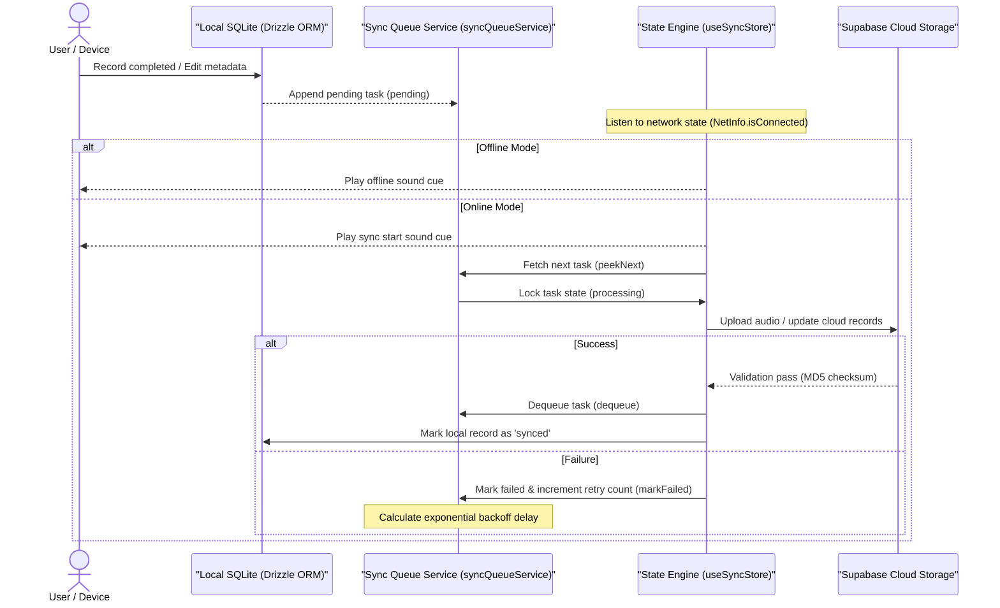
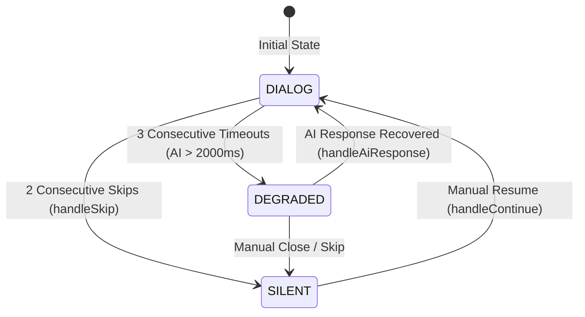
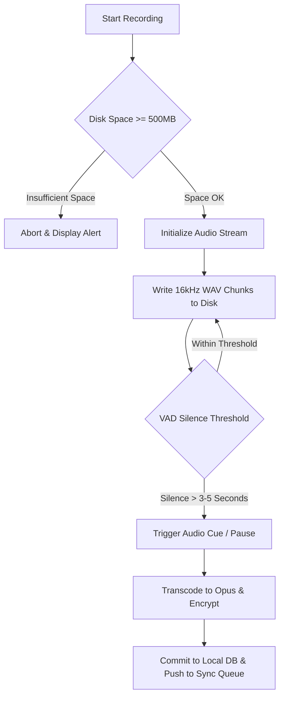

# TimeLog

[](LICENSE)
[](README_EN.md)
[](README_EN.md)

[🇨🇳 中文](README.md) | [🇺🇸 English](README_EN.md)

---

## 📖 Introduction

**TimeLog** is a local-first voice diary mobile application designed for elderly users, built with **React Native (Expo SDK 54)**, **Drizzle ORM**, **SQLite**, and **Supabase**. The project addresses data security, accessibility, and offline usability challenges faced by senior citizens under unreliable mobile network conditions. Key features include local-first offline synchronization, AI voice dialog orchestration, active network quality probing, native audio pre-flight validation, and chunked AES encryption.

---

## 🛠️ Core Architecture & Engineering Design

All architectural components below are fully implemented in this repository. Click any source code link to inspect the implementation details:

### 1. Local-First Sync Engine & Offline State Management 🚀

*   **Design Rationale**: To withstand spotty mobile networks, TimeLog enforces a "Local-First" write policy. All user actions (voice recording, story updates, metadata edits) are immediately committed to local SQLite databases first, while appending background sync tasks to an execution queue.
*   **Implementation Details**:
    - State Machine Listening: Listens to real-time network and lifecycle changes via `@react-native-community/netinfo` and `AppState`.
    - Retry Strategy: Failed sync tasks execute exponential backoff retries. Tasks exceeding retry limits are marked for re-queueing upon app relaunch or network recovery.
    - Sound Cue Feedback: Plays audio cues upon network transition to subtly inform elderly users of sync progress.
*   **Synchronization Sequence Diagram**:



*   **📂 Direct Source Code Links**:
    - [queue.ts (Sync Queue Service)](src/lib/sync-engine/queue.ts)
    - [store.ts (Sync State Machine Engine)](src/lib/sync-engine/store.ts)
    - [syncQueue.ts (Sync Queue Database Schema)](src/db/schema/syncQueue.ts)

---

### 2. Voice Agent & Three-Mode Dialog Orchestrator 🤖

*   **Design Rationale**: Guides senior citizens through personal story recollections using AI voice conversations tailored for elderly speech cadence and high-latency mobile networks.
*   **Implementation Details**:
    - **Voice Agent Service**: Built on LiveKit Agents 1.x. Utilizes Deepgram Nova-3 STT for multilingual recognition, Deepgram TTS for natural voice generation, and Silero VAD for pause detection. Injects `storyId`, `topicText`, and `language` into System Prompts via participant metadata.
    - **Three-Mode Orchestrator**: Client maintains `DIALOG` (Online interaction), `DEGRADED` (Response timeout fallback), and `SILENT` (User skip/silence) modes. If AI response latency exceeds 2000ms for 3 consecutive turns, the system automatically degrades to `DEGRADED` mode.
    - **Concurrency**: Audio capture runs on a dedicated background thread, ensuring AI timeout state transitions never disrupt local recording disk writes.
*   **Prompt Harness**:
    - XML Constraints: Enforces `<role>`, `<core_rules>`, and `<conversation_state_machine>` tags in `prompts.py` to prohibit markdown/emoji formatting in speech output.
    - Self-Reflection: Includes `<quality_check_before_reply>` prompting the model to verify word count and limit output to a single open question.
*   **Dialog State Machine Diagram**:



*   **📂 Direct Source Code Links**:
    - [story_agent.py (LiveKit Agent Service)](agents/story_agent.py)
    - [prompts.py (System Prompt Definitions)](agents/prompts.py)
    - [AiDialogOrchestrator.ts (Local Dialog Orchestrator Engine)](src/features/recorder/services/AiDialogOrchestrator.ts)

---

### 3. Active Network Quality Probing Service 📶

*   **Design Rationale**: Conventional passive network checks fail to detect "high latency / packet loss" weak networks, where initiating real-time voice sessions causes stuttering.
*   **Implementation Details**:
    - Active Probing: Issues lightweight ping probes to Supabase Edge Functions every 650ms during active recording.
    - Metric Calculations: Computes **RTT (Round Trip Time)**, **Packet Loss**, and **Jitter**.
    - Sliding Window Filter: Marks connection as offline if 3 consecutive pings fail within 2 seconds, immediately switching to local recording mode.
*   **📂 Direct Source Code Links**:
    - [NetworkQualityService.ts (Network Metric Probing Service)](src/features/recorder/services/NetworkQualityService.ts)

---

### 4. Native Audio Recording & Senior VAD Optimization 🎙️

*   **Design Rationale**: Prevents audio loss during hardware glitches or low disk space while tuning voice activity detection to senior speech patterns.
*   **Implementation Details**:
    - Storage Pre-flight: Invokes `FileSystem.getFreeDiskStorageAsync()` prior to recording; aborts startup if free space is under 500MB.
    - Streaming Append: Writes 16kHz WAV audio chunks directly to disk to prevent un-saved audio loss on app crashes.
    - VAD Tuning: Sets silence duration thresholds (`min_silence_duration`) to 3~5 seconds to accommodate slower speech rhythms.
*   **Recording Pipeline Diagram**:



*   **📂 Direct Source Code Links**:
    - [recorderService.ts (Audio Control Service)](src/features/recorder/services/recorderService.ts)
    - [audioConfig.ts (Audio Stream Configuration)](src/features/recorder/services/audioConfig.ts)
    - [vadConfig.ts (Local VAD Parameters)](src/features/recorder/services/vadConfig.ts)

---

### 5. AI Text Polish & Local PDF Export 📄

*   **Design Rationale**: Transcribed speech contains oral filler words and sentence fragmentation, requiring structural polishing for reading.
*   **Implementation Details**:
    - Text Formatting: Invokes `polish-text` Cloud Function using LLMs to strip filler words and format logical paragraphs.
    - Local PDF Rendering: Converts HTML templates locally via `expo-print` in React Native.
    - System Sharing: Triggers native OS share sheets via `expo-sharing` for printing and file transfer.
*   **📂 Direct Source Code Links**:
    - [usePdfExport.ts (PDF Generation & Export Hook)](src/features/story-gallery/hooks/usePdfExport.ts)

---

### 6. Proxy-Based Multi-Language Data Proxy 🌐

*   **Design Rationale**: The app embeds 36 preset senior topic prompts. Traditional localization requires refactoring underlying data array calls.
*   **Implementation Details**:
    - ES6 Proxy Interception: Wraps static `TOPIC_QUESTIONS` arrays using ES6 Proxies, intercepting `map`, `filter`, `find`, and index accessors.
    - Dynamic Mapping: Intercepts access calls to read current locale packs from `i18nStore` and swap `text` fields dynamically with zero caller refactoring.
*   **📂 Direct Source Code Links**:
    - [topicQuestions.ts (Localization Proxy Wrapper)](src/features/recorder/data/topicQuestions.ts)
    - [i18nStore.ts (i18n Persistence Store)](src/lib/i18n/i18nStore.ts)

---

### 7. Accessibility Design & Localized Calendars 🎨

*   **Design Rationale**: Optimizes UI contrast for low-vision elderly users while adapting to regional calendar preferences (e.g., Thai Buddhist Calendar).
*   **Implementation Details**:
    - Contrast & Fonts: Meets WCAG 2.2 AAA standards with dynamic font scaling stored in MMKV and SQLite user tables.
    - Calendar Formatting: Uses `Intl.DateTimeFormat` to dynamically convert Gregorian dates to Thai Buddhist Calendar format under Thai locales.
*   **📂 Direct Source Code Links**:
    - [useHomeDisplayData.ts (Date Formatting Service)](src/features/home/hooks/useHomeDisplayData.ts)
    - [accessibilityStore.ts (Accessibility State Manager)](src/lib/accessibilityStore.ts)

---

### 8. Activity-Aware Gentle Nudge & Native Notifications 🔔

*   **Design Rationale**: Encourages regular recording sessions without disturbing users during nighttime hours.
*   **Implementation Details**:
    - Activity Analysis: Evaluates user recording frequencies in `nudgeService.ts` to schedule reminders during inactive periods.
    - Local Notification Scheduling: Registers native OS reminders via `expo-notifications` while respecting quiet hour settings (default 21:00 - 09:00).
*   **📂 Direct Source Code Links**:
    - [nudgeService.ts (Activity Analysis & Notification Logic)](src/lib/notifications/nudgeService.ts)
    - [notifications.ts (Native Notification Wrappers)](src/lib/notifications.ts)

---

### 9. Multi-Account Local SQLite Isolation 🛡️

*   **Design Rationale**: On shared family devices, multiple seniors may log in on the same phone. Local data must remain physically isolated.
*   **Implementation Details**:
    - User ID Filtering: Enforces `sessionUserId` (from Zustand `useAuthStore`) as mandatory `WHERE` clauses on all Drizzle ORM queries.
    - Guest Sandbox: Stores un-authenticated records under `userId IS NULL` sandboxes, hardening isolation upon account activation.
*   **📂 Direct Source Code Links**:
    - [useStories.ts (User-Filtered Story Query Hook)](src/features/story-gallery/hooks/useStories.ts)
    - [recorderService.ts (Audio & User Binding Service)](src/features/recorder/services/recorderService.ts)

---

### 10. AES-256-CTR Local Audio Encryption & Versioning 🔒

*   **Design Rationale**: Protects senior privacy against file leaks on public mobile storage while supporting backward-compatible playback.
*   **Implementation Details**:
    - Chunk Encryption: Encrypts PCM/Opus files locally via `aes-js` using 256-bit CTR mode keys.
    - Versioned Headers: Prepends algorithm version identifiers to file headers, allowing the decryption engine to select compatible modules for legacy files.
*   **📂 Direct Source Code Links**:
    - [audioEncryption.ts (Audio File Encryption Service)](src/lib/audioEncryption.ts)

---

### 11. Passwordless Device Code Pairing & Labeling 🔑

*   **Design Rationale**: Simplifies login for elderly users unable to navigate complex password inputs.
*   **Implementation Details**:
    - Pairing Logic: Mobile app requests a single-use `Device Code` from Supabase; family members enter the code on a PC browser to establish cloud account linkage.
    - Device Aliases: Relatives can name connected devices (e.g., "Grandma's Box") in the Web admin panel for remote management.
*   **📂 Direct Source Code Links**:
    - [deviceCodesService.ts (Device Code Generator & Polling)](src/features/auth/services/deviceCodesService.ts)
    - [anonymousAuthService.ts (Anonymous Auth Upgrade Service)](src/features/auth/services/anonymousAuthService.ts)

---

## 📂 Project Structure

```text
TimeLog
├── app/                           # Expo Router Structure
│   ├── (auth)/                    # Auth pairing & login routes
│   ├── (tabs)/                    # Tab screens (Gallery, Recorder, Settings)
│   └── _layout.tsx                # App Providers & Context mounts
├── src/                           # Core Source Code
│   ├── db/                        # Local SQLite & Drizzle ORM Schemas
│   ├── features/                  # Domain Features (Auth, Recorder, Gallery)
│   ├── lib/                       # Infrastructure Wrappers (Sync Engine, AES)
│   ├── components/ui/             # Shared UI components
│   └── utils/                     # Helper utilities
├── agents/                        # LiveKit Agent Server (Python)
├── tests/                         # Integration Tests & Mocks
├── drizzle.config.ts              # Drizzle ORM Compiler Config
└── package.json                   # Dependencies
```

---

## 📊 Technology Stack Matrix

| Layer | Core Technology | Role |
|:------|:-----------|:--------|
| **App Engine** | React Native (Expo SDK 54) | Cross-Platform Native Architecture |
| **Language** | TypeScript (Strict Mode) | Type Safety |
| **Local Storage** | Drizzle ORM + expo-sqlite | Local Database Storage & Transactions |
| **State Sync** | TanStack Query v5 | Cloud Endpoint Caching |
| **State Manager**| Zustand v5 | App Global State Engine |
| **Key-Value Cache**| MMKV | Fast Persistence Storage |
| **File Encryption**| aes-js (AES-256-CTR) | Chunked Audio Encryption |
| **Localization** | Zustand + MMKV i18n | UI Localization |
| **Audio Stream** | @siteed/expo-audio-stream | Audio Stream Capture |

---

## 📦 Testing & Verification

Core components pass automated unit and integration test suites.

```bash
# Run test suite
npm test

# Local development startup
npm install
npx drizzle-kit generate
npx expo start --dev-client
```

---

## 📜 License

Licensed under the [MIT License](LICENSE).
